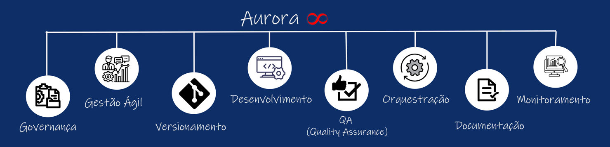

# Aurora 8 

O **Aurora 8** é um framework que **não apenas estrutura o desenvolvimento e orquestração de automações**, mas também **valoriza o conhecimento gerado através da documentação**, garantindo **sustentação**, **escalabilidade** e **monitoramento contínuo**.

## Visão Geral

O **Aurora 8** foi projetado para **guiar todo o ciclo de vida de um projeto de automação**, proporcionando uma abordagem completa que inclui:

1. Governança  
2. Gestão Ágil  
3. Versionamento  
4. Desenvolvimento  
5. Quality Assurance (QA)  
6. Orquestração  
7. Documentação  
8. Monitoramento

Este modelo foi criado para **padronizar** processos, **minimizar riscos** e **potencializar os resultados** de automações em ambientes corporativos.

## Estrutura do Framework

O **Aurora 8** está organizado em **oito pilares fundamentais** para garantir a **qualidade, escalabilidade e sustentação** de automações corporativas:

---

### Governança

- TAP (Termo de Abertura do Projeto)  
- Análise de Requisitos  
- Desenho BPM  
- Diagramas digraphviz

---

### Gestão Ágil

- Criação de Backlog  
- Quadro Kanban

---

### Versionamento

- Repositório GitLab para versionar:
  - Código
  - Automações
  - Infraestrutura (Dockerfiles, Compose)

---

### Desenvolvimento

- Execução e implementação das automações  
- Uso de containers Docker

---

### QA (Quality Assurance)

- Testes automatizados via orquestradores:
  - GitLab CI/CD
  - Jenkins

---

### Orquestração

- Pipelines CI/CD utilizando Docker para:
  - Builds automáticos  
  - Testes  
  - Deploys

---

### Documentação

- Uso de Markdown para documentação técnica (README.md)  
- Publicação estruturada com GitBook

---

### Monitoramento

- Monitorar serviços, APIs, automações e containers  
- Alertas para falhas e indisponibilidades

---

Cada pilar foi pensado para **suportar todo o ciclo de vida da automação**, garantindo **sustentação, escalabilidade** e **visibilidade** em cada etapa do processo.

# Time

| [ Patrick Ataíde](https://github.com/pasilva1) |
| :---: |

