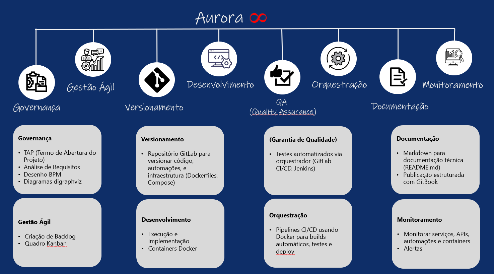
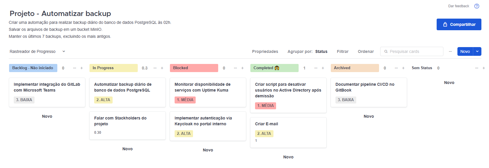
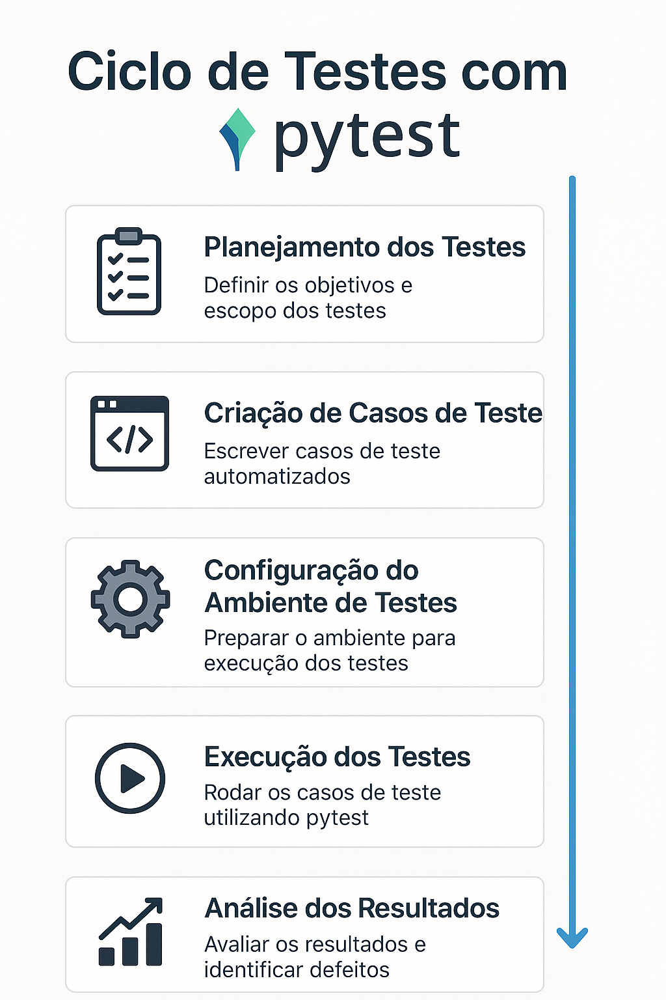

# Aurora 8 
## Ciclo de vida de um projeto de automação.

O **Aurora 8** é um framework que **não apenas estrutura o desenvolvimento e orquestração de automações**, mas também **valoriza o conhecimento gerado através da documentação**, garantindo **sustentação**, **escalabilidade** e **monitoramento contínuo**.

## Visão Geral

O **Aurora 8** foi projetado para **guiar todo o ciclo de vida de um projeto de automação**, proporcionando uma abordagem completa que inclui:

1. Governança  
2. Gestão Ágil  
3. Versionamento  
4. Desenvolvimento  
5. Quality Assurance (QA)  
6. Orquestração  
7. Documentação  
8. Monitoramento

Este modelo foi criado para **padronizar** processos, **minimizar riscos** e **potencializar os resultados** de automações em ambientes corporativos.

## Estrutura do Framework

O **Aurora 8** está organizado em **oito pilares fundamentais** para garantir a **qualidade, escalabilidade e sustentação** de automações corporativas:

---

### Governança

- TAP (Termo de Abertura do Projeto) - [TAP (Termo de Abertura do Projeto)](TAP.md) 
- Análise de Requisitos  
  - Desenho BPM
    - Draw.io , suporte nativo BPMN com templates prontos. [Deploy via Docker - Draw.io](Drawio.yml)
    - Excalidraw , indicado para **brainstorming** e **mockups** rápidos. [Deploy via Docker - Excalidraw](excalidraw.yml)
  - Diagramas digraphviz - Digraph G - [Digraph G](https://dreampuf.github.io/GraphvizOnline)

---

### Gestão Ágil

- Criação de Backlog  - Exporta arquivo para criação de backlog no app **Focalboard** [Arquivo p/ exportar](archive.boardarchive)
- Quadro Kanban - Aplicativo de gerenciamento visual de tarefas **Focalboard** focado em gestão de projetos e tarefas colaborativas estilo **Trello** ou **Notion** [Deploy via Docker - focalboard](focalboard.yml)

#### Quem cria o backlog em projetos ágeis (Scrum ou Kanban)?

| Papel                     | Função no Backlog                                                                 |
|---------------------------|----------------------------------------------------------------------------------|
| Product Owner (PO)        | Principal responsável por **criar, manter e priorizar** o backlog com base em **objetivos do negócio**. Define **o que** precisa ser feito. |
| Equipe Técnica (Dev/QA/DevOps) | Apoia no **refinamento técnico**, detalha **como** fazer, aponta **complexidade**, **dependências** e **riscos**. |
| Stakeholders              | Contribuem sugerindo **demandas, requisitos** ou **feedback** (usuários, clientes, áreas internas). |

#### Responsabilidades práticas do Product Owner

O Product Owner é responsável por:

- Criar **cards** no Focalboard com:
  - **Título descritivo da tarefa** (ex: `Automatizar envio de e-mails`)
  - **Descrição clara** com requisitos funcionais e não funcionais
  - **Prioridade** (Alta, Média, Baixa)
  - **Critérios de aceitação** (ex: `E-mail enviado em até 5 minutos após status "Venda Concluída"`)

- Organizar os cards em colunas:

| Coluna       | Significado                                 |
|--------------|---------------------------------------------|
| Backlog      | Tarefas planejadas ainda não selecionadas   |
| In Progress  | Tarefas atualmente em desenvolvimento       |
| Blocked      | Tarefas com algum tipo de impedimento       |
| Completed    | Tarefas concluídas com sucesso              |
| Archived     | Tarefas arquivadas                          |

---
### Versionamento

- Cartilha Git - Boas práticas - Fluxo entre **main** e **dev**. - [Cartilha Git](Cartilha_Git.md) 
  - Introdução do Git / Beneficios
  - Estrutura do Git / Fluxo de Arquivos no Git
  - Conceito de Branches (main e dev)
  - Comandos Essenciais
  - Integrando dev no main (merge)
  

- Repositório GitLab para versionar:
  - Código
  - Automações
  - Infraestrutura (Dockerfiles, Compose)

---

### Desenvolvimento

- Execução e implementação das automações  
- Uso de containers Docker

---

### QA (Quality Assurance)

- Testes automatizados via orquestradores:
  - Ciclo dos testes
    - Planejar os teste
    - Criar o designer dos testes
    - Configurar o ambinete de testes
    - Executar os testes
    - Analisar os resultados
  - GitLab CI/CD
  - Jenkins

---

### Orquestração

- Pipelines CI/CD utilizando Docker para:
  - Builds automáticos  
  - Testes  
  - Deploys

---

### Documentação

- Uso de Markdown para documentação técnica (README.md)  
- Publicação estruturada com GitBook

---

### Monitoramento

- Monitorar serviços, APIs, automações e containers  
- Alertas para falhas e indisponibilidades

---

Cada pilar foi pensado para **suportar todo o ciclo de vida da automação**, garantindo **sustentação, escalabilidade** e **visibilidade** em cada etapa do processo.

# Time

| [ Patrick Ataíde](https://github.com/pasilva1) |
| :---: |

